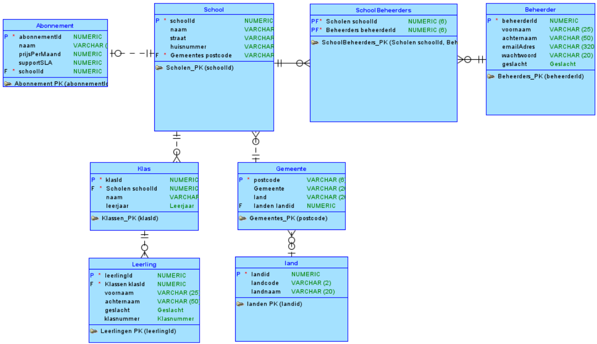

Milestone 2: Modellering
---
TOP DOWN MODELERING
---

Conceptueel Model
---

    Entiteittypes + Attributen + PK
---
- School (**schoolId**, naam)
- Klas (**klasId**, naam, leerjaar)
- Leerling (**leerlingId**, voornaam, familienaam, klasnummer)
- SchoolBeheerder(**schoolId**,**beheerderId**, beheerderSinds)
- Beheerder ( **beheerderId**, voornaam, familienaam, emailAdres, wachtwoord,geslacht)
- Adres (**Adres**, straatnaam, huisnummer, bus, postcode, gemeente)
---
    Domeinen - constraints
---
- Klas: leerjaar moet tussen 0 en 7 zijn
- Leerling: geslacht moet M, V of X zijn
- Leerling: klasnummer moet tussen 0 en 41 zijn
- Beheerder: geslacht moet M, V of X zijn

    Tijd 
---
- SchoolBeheerder: beheerderSinds

---
    Conceptueel ERD
---

Logisch Model
---

    Intermediërende  entiteiten
---
- SchoolBeheerders: Scholen - Beheerder

    Logisch ERD
---

Verschillen na Normalisatie
---
- Extra entiteiten:
  - Gemeentes
  - Landen
  - Abonnement
- Verwijderde entiteit: Adres

