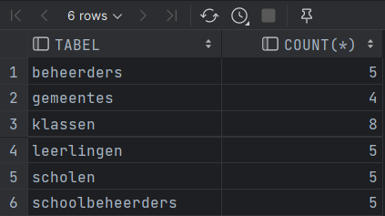
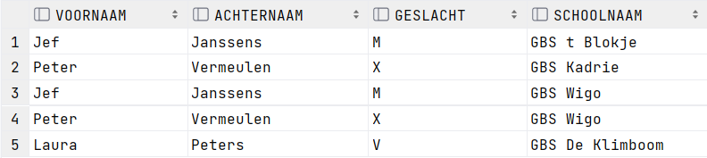
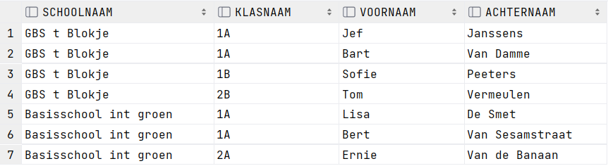
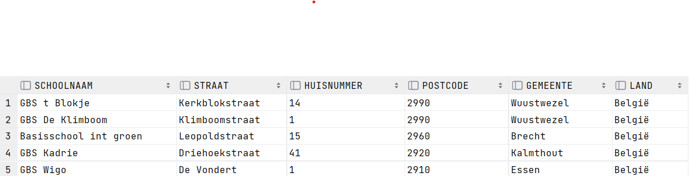
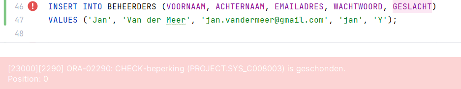
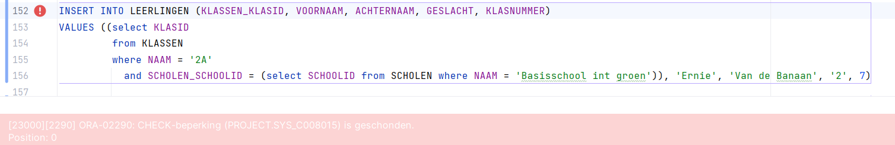
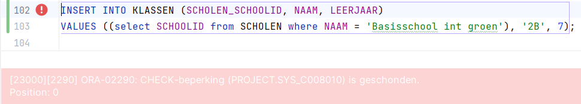
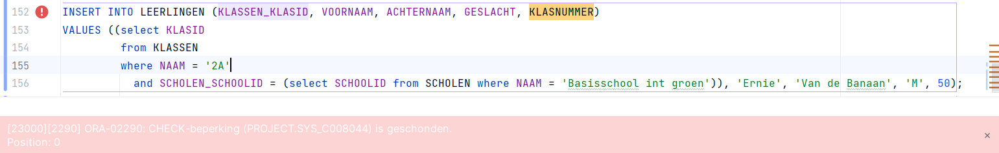

Milestone 3: Creatie Databank
---

    Identity columns

---

- Mandatory
    - scholen: schoolid
    - beheerders: beheerderid
    - klassen: klasid
    - leerlingen: leerlingid
- other:
    - none

      Table Counts

---

    @query 1: Relatie Veel-op-veel

    SELECT b.VOORNAAM,
       b.ACHTERNAAM,
       b.GESLACHT,
       s.NAAM AS Schoolnaam

    FROM beheerders b
    
        INNER JOIN SCHOOLBEHEERDERS SB on b.BEHEERDERID = SB.BEHEERDERS_BEHEERDERID
        INNER JOIN SCHOLEN S on SB.SCHOLEN_SCHOOLID = S.SCHOOLID;

--- 

    @query 2: 2 niveau’s diep

    SELECT s.NAAM as schoolnaam,
       k.NAAM as klasnaam,
       l.VOORNAAM,
       l.ACHTERNAAM
    from SCHOLEN s
      join KLASSEN K on s.SCHOOLID = K.SCHOLEN_SCHOOLID
      join LEERLINGEN L on K.KLASID = L.KLASSEN_KLASID;

--- 

    @query 3: School addressen

    SELECT
        s.NAAM as schoolnaam,
        s.STRAAT as straat,
        s.HUISNUMMER as huisnummer,
        g.POSTCODE as postcode,
        g.GEMEENTE as gemeente
    FROM SCHOLEN S
    JOIN GEMEENTES G on s.GEMEENTES_POSTCODE = G.POSTCODE;

--- 

  

Bewijs Domeinen - constraints M2
--- 

    Beheerder: Geslacht - M,v of x

---

    Leerling: Geslacht - M,v of x

---

    Klas: leerjaar - 1 tot en met 6

---

    Leerling: klasnummer - 1 tot en met 40

---

